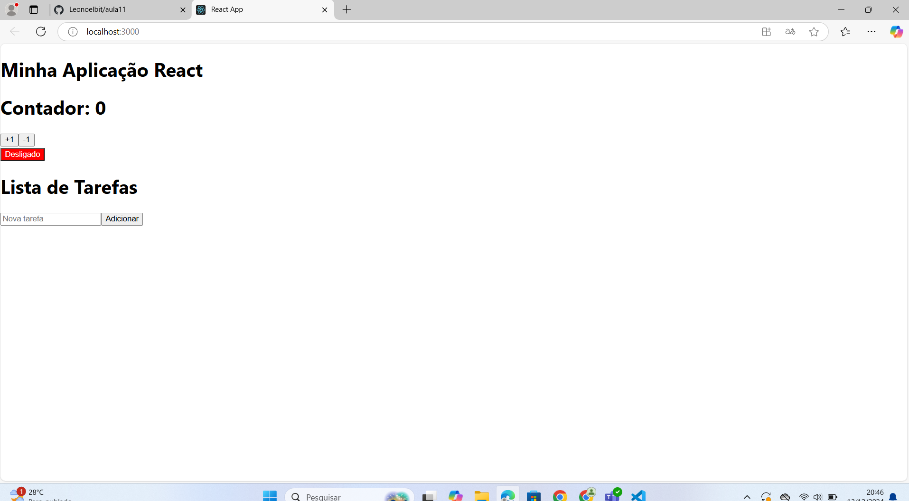

# Documentação de Exemplos e Exercícios React

## Índice

1. [Contador Simples com useState](#contador-simples-com-usestate)
2. [Botão Alternador de Texto](#botão-alternador-de-texto)
3. [Gerenciando uma Lista de Tarefas](#gerenciando-uma-lista-de-tarefas)
4. [Usando React.Fragment e Elementos Aninhados](#usando-react.fragment-e-elementos-aninhados)
5. [Criando e Renderizando um Componente de Tarefa](#criando-e-renderizando-um-componente-de-tarefa)
6. [Estrutura Completa do App](#estrutura-completa-do-app)

## Contador Simples com useState

### Objetivo
Criar um componente funcional que utilize o hook `useState` para implementar um contador.

### Instruções

1. **Crie um componente chamado `Contador`**
2. **Exibição**:
    - Um número que começa em 0.
    - Dois botões: um para incrementar (+1) e outro para decrementar (-1).
3. **Gerenciamento de estado**: Utilize o hook `useState` para gerenciar o estado do número exibido.

### Desafio Extra

Adicionar uma validação para impedir que o número fique negativo.

### Código

```jsx
import React, { useState } from 'react';

const Contador = () => {
  const [contagem, setContagem] = useState(0);

  const incrementar = () => {
    setContagem(contagem + 1);
  };

  const decrementar = () => {
    if (contagem > 0) {
      setContagem(contagem - 1);
    }
  };

  return (
    <div>
      <h1>Contador: {contagem}</h1>
      <button onClick={incrementar}>+1</button>
      <button onClick={decrementar}>-1</button>
    </div>
  );
};

export default Contador;
```

---

## Botão Alternador de Texto

### Objetivo
Implementar um botão que alterna entre dois textos ao ser clicado.

### Instruções

1. **Crie um componente chamado `BotaoAlternador`**
2. **Exibição**:
    - Um botão que exibe "Ligado" ou "Desligado", dependendo do estado atual.
3. **Gerenciamento de estado**: Utilize o hook `useState` para gerenciar o estado do texto.

### Desafio Extra

Adicionar um estilo CSS diferente para cada estado ("Ligado" em verde e "Desligado" em vermelho).

### Código

```jsx
import React, { useState } from 'react';

const BotaoAlternador = () => {
  const [ligado, setLigado] = useState(false);

  const alternar = () => {
    setLigado(!ligado);
  };

  return (
    <button onClick={alternar} style={{ backgroundColor: ligado ? 'green' : 'red', color: 'white' }}>
      {ligado ? 'Ligado' : 'Desligado'}
    </button>
  );
};

export default BotaoAlternador;
```

---

## Gerenciando uma Lista de Tarefas

### Objetivo
Criar um aplicativo simples para adicionar itens a uma lista.

### Instruções

1. **Crie um componente chamado `ListaDeTarefas`**
2. **Exibição**:
    - Um campo de texto para digitar o nome da tarefa.
    - Um botão "Adicionar".
    - Uma lista de tarefas adicionadas.
3. **Gerenciamento de estado**: Utilize o hook `useState` para gerenciar o estado da lista de tarefas e o valor do campo de texto.

### Código

```jsx
import React, { useState } from 'react';
import Task from './Task';

const ListaDeTarefas = () => {
  const [tarefas, setTarefas] = useState([]);
  const [novaTarefa, setNovaTarefa] = useState('');

  const adicionarTarefa = () => {
    if (novaTarefa.trim()) {
      setTarefas([...tarefas, novaTarefa]);
      setNovaTarefa('');
    }
  };

  return (
    <div>
      <h1>Lista de Tarefas</h1>
      <input 
        type="text" 
        value={novaTarefa} 
        onChange={(e) => setNovaTarefa(e.target.value)} 
        placeholder="Nova tarefa" 
      />
      <button onClick={adicionarTarefa}>Adicionar</button>
      <ul>
        {tarefas.map((tarefa, index) => (
          <li key={index}><Task title={`Tarefa ${index + 1}`} description={tarefa} /></li>
        ))}
      </ul>
    </div>
  );
};

export default ListaDeTarefas;
```

---

## Usando React.Fragment e Elementos Aninhados

### Objetivo
Utilizar `React.Fragment` para envolver itens sem adicionar um nó extra no DOM.

### Código

```jsx
import React from 'react';

const TaskContainer = () => {
  return (
    <React.Fragment>
      <div className="task">
        <h3>Tarefa 1</h3>
        <p>Descrição da Tarefa 1</p>
      </div>
      <div className="task">
        <h3>Tarefa 2</h3>
        <p>Descrição da Tarefa 2</p>
      </div>
      <div className="task">
        <h3>Tarefa 3</h3>
        <p>Descrição da Tarefa 3</p>
      </div>
    </React.Fragment>
  );
};

export default TaskContainer;
```

---

## Criando e Renderizando um Componente de Tarefa

### Objetivo
Criar um componente que receba props contendo o título e a descrição de uma tarefa e renderizá-los.

### Instruções

1. **Crie um novo arquivo chamado `src/components/Task.js`**.
2. **Receba as props `title` e `description`** e renderize-as.

### Código

```jsx
import React from 'react';
import PropTypes from 'prop-types';

const Task = ({ title, description }) => {
  return (
    <div className="task">
      <h3>{title}</h3>
      <p>{description}</p>
    </div>
  );
};

Task.propTypes = {
  title: PropTypes.string.isRequired,
  description: PropTypes.string.isRequired,
};

export default Task;
```

---

## Estrutura Completa do App

### Código

```jsx
import React from 'react';
import Contador from './components/Contador';
import BotaoAlternador from './components/BotaoAlternador';
import ListaDeTarefas from './components/ListaDeTarefas';

function App() {
  return (
    <div className="App">
      <h1>Minha Aplicação React</h1>
      <Contador />
      <BotaoAlternador />
      <ListaDeTarefas />
    </div>
  );
}

export default App;
```

---

### Estrutura do Projeto

- `src`
  - `components`
    - `Contador.js`
    - `BotaoAlternador.js`
    - `Task.js`
    - `ListaDeTarefas.js`
  - `App.js`

